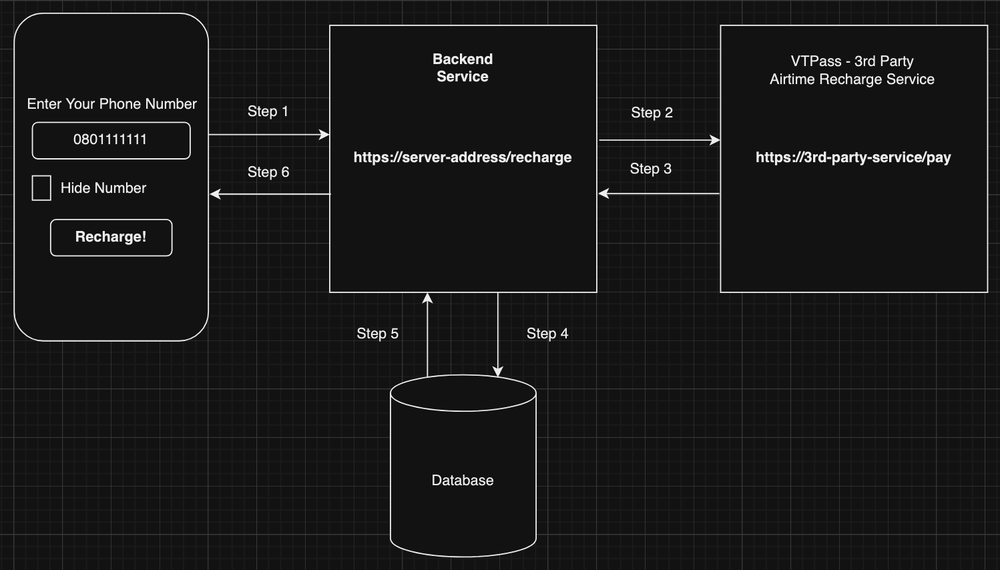

# NYSC Camp Demo - November 2023 by iSTEMLabs.Africa

Welcome to the 5-day Software Engineering crash course for Youth Corpers. If you would like to sign up for the full course, please visit the [Software Engineering: Foundation](https://istemlabs.africa/software-engineering-track/foundation-course) course page at [iSTEMLabs.Africa](https://www.istemlabs.africa)

## Architecture
This is an overview of the application we will be building over the next 5 days

## Topics

We will briefly discuss the following topics over the next 5-days of our class:

* Web Application Architecture
* HTML/CSS/JavaScript
* Server-side Programming with Python (FastAPI)
* Working with Databases
* 3rd-Party REST API Services 
  * VTPass.com Airtime Recharge Service

## Tools

* [Github](https://github.com) account
* [Replit](https://replit.com) account
* Your computing device e.g. your smartphone